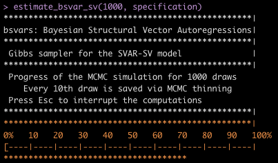

<!-- README.md is generated from README.Rmd. Please edit that file -->

# bsvars

Bayesian Estimation of Structural Vector Autoregressive Models

This package provides efficient algorithms for Bayesian estimation of
Structural Vector Autoregressive (SVAR) models via Markov chain Monte
Carlo methods. A wide range of SVAR models is considered, including
homo- and heteroskedastic specifications and those with non-normal
structural shocks.

# Installation

Just open your **R** and type:

    install.packages("bsvars")

# Start your Bayesian analysis of data

The beginnings are as easy as ABC:

``` r
# upload the package
library(bsvars)

# upload data
data(us_fiscal_lsuw)
 
# specify the model and set seed
specification  = specify_bsvar_sv$new(us_fiscal_lsuw, p = 4)
set.seed(123)
 
# run the burn-in
burn_in        = estimate_bsvar_sv(1000, specification)

# estimate the model
posterior      = estimate_bsvar_sv(50000, burn_in$get_last_draw(), thin = 10)

# normalise the posterior
BB            = posterior$last_draw$starting_values$B      # get the last draw of B
B_hat         = diag(sign(diag(BB))) %*% BB                # set positive diagonal elements
normalise_posterior(posterior, B_hat)                      # draws in posterior are normalised

# Now, you're ready to analyse your model!
```

# Progress bar

MCMCs for multivariate dynamic structural models might take a while to
run. **bsvars** relies on efficient algorithms and fast codes developed
using **cpp** code via **Rcpp** and **RcppArmadillo** packages to cut
the time of computations by orders of magnitude. Still, while waiting
these a few minutes, you can track the progress by looking at the
beautiful progress bar:



## License

This package is distributed under license GPL (\>= 3)

Copyright © 2022 Tomasz Woźniak (email: <wozniak.tom@pm.me>)

<!-- badges: start -->

[](https://github.com/donotdespair/bsvars/actions/workflows/R-CMD-check.yaml)
<!-- badges: end -->
